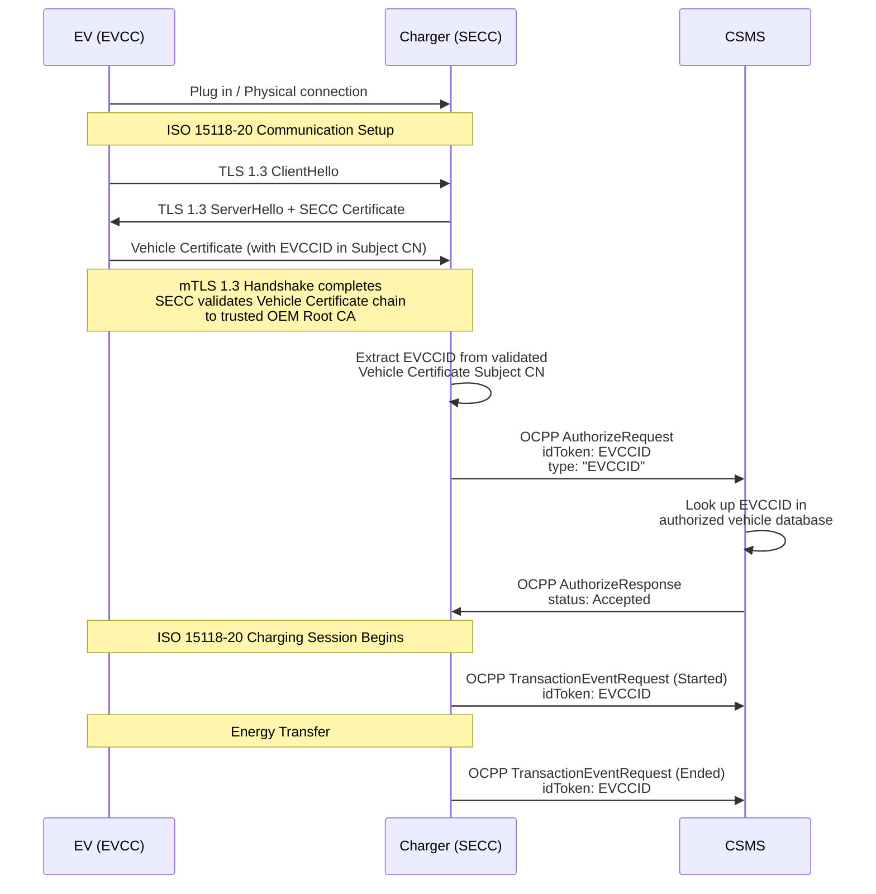
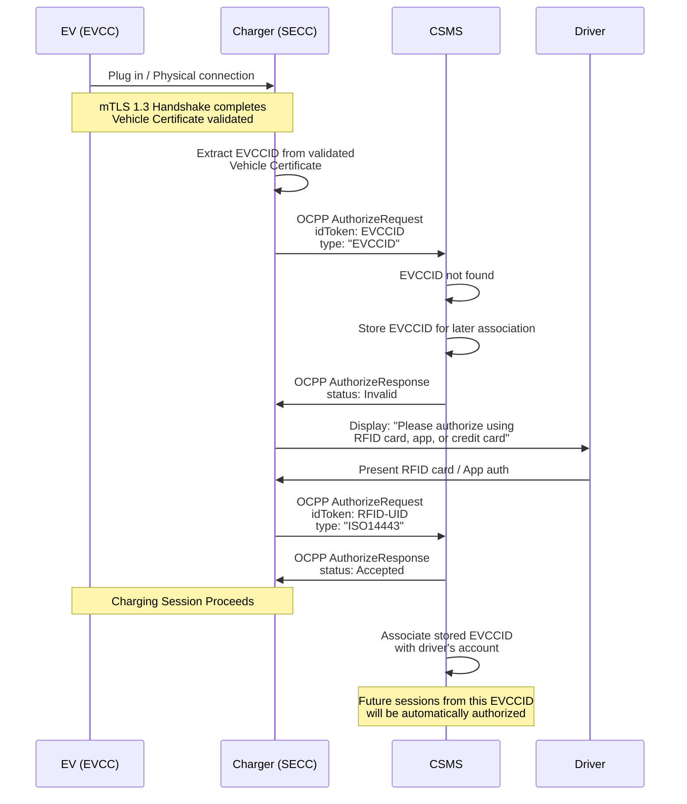
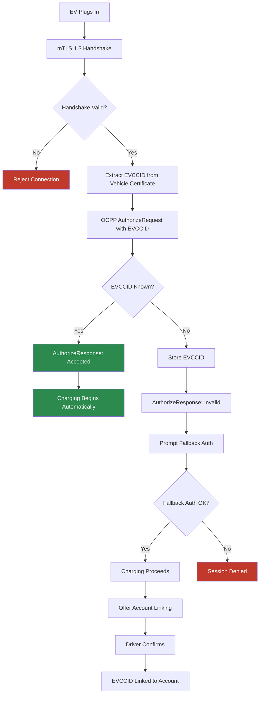

# SEID-Auth: Secure EVCCID Authorization for Electric Vehicle Charging

**Version:** 1.0 DRAFT  
**Date:** March 2026  
**Status:** Proposal for community review

---

## Abstract

This document proposes **SEID-Auth** (Secure EVCCID Authorization), a method for automatic authorization of Electric Vehicles (EVs) at EV Supply Equipment (EVSE) using the EVCCID extracted from the Vehicle Certificate during a mandatory mutual TLS (mTLS) 1.3 handshake as defined by ISO 15118-20.

SEID-Auth addresses the security limitations of MAC-address-based Autocharge while avoiding the full ecosystem complexity of ISO 15118 Plug & Charge (PnC). It leverages cryptographic infrastructure that ISO 15118-20 already mandates — the mTLS handshake between EVCC and SECC — to provide a vehicle identifier (the EVCCID) that is cryptographically authenticated, spoof-proof, and standards-based.

The method uses OCPP 2.0.1/2.1 Authorize mechanisms to transmit the EVCCID to the Charging Station Management System (CSMS), enabling seamless automatic charging sessions with a security posture far superior to traditional Autocharge — without adding any PKI requirements beyond what ISO 15118-20 already mandates.

---

## Table of Contents

1. [Introduction](#1-introduction)
2. [Background and Motivation](#2-background-and-motivation)
3. [Core Concept](#3-core-concept)
4. [Protocol Specification](#4-protocol-specification)
5. [Enrollment Models](#5-enrollment-models)
6. [Certificate Renewal Handling](#6-certificate-renewal-handling)
7. [OCPP Integration](#7-ocpp-integration)
8. [Security Analysis](#8-security-analysis)
9. [Implementation Considerations](#9-implementation-considerations)
10. [Standards Body Engagement](#10-standards-body-engagement)
11. [Glossary](#11-glossary)
12. [References](#12-references)

---

## 1. Introduction

The EV charging industry has long sought a method for automatic vehicle authorization that balances user convenience, security, and implementation simplicity. Two approaches exist today:

- **Autocharge** uses the EV's MAC address as a vehicle identifier, transmitted during the DIN 70121 or ISO 15118 communication setup. It is simple to implement but fundamentally insecure — MAC addresses can be spoofed, are not cryptographically protected, and some OEMs have switched to randomized MAC addresses, breaking compatibility.

- **Plug & Charge (PnC)**, defined in ISO 15118, uses a full PKI ecosystem with contract certificates issued by eMobility Service Providers (eMSPs) through a certificate pool. It is cryptographically secure but requires significant ecosystem coordination beyond the base ISO 15118-20 PKI: MO sub-CAs, contract certificate provisioning, certificate pool infrastructure, and bilateral roaming agreements.

SEID-Auth introduces a third path. It exploits a key development in ISO 15118-20: the **mandatory use of mutual TLS 1.3** for all communication sessions between the EV Communication Controller (EVCC) and the Supply Equipment Communication Controller (SECC), including sessions using External Identification Means (EIM). This mTLS requirement means the SECC already receives and cryptographically validates the EV's Vehicle Certificate during every session. The EVCCID, embedded in the Vehicle Certificate's subject common name, becomes a cryptographically authenticated vehicle identifier — available "for free" as a byproduct of the mandatory security handshake.

Crucially, **SEID-Auth does not add any PKI requirements** beyond what ISO 15118-20 already mandates. The V2G Root CA trust anchors and OEM Root Certificate distribution (via a Root Certificate Pool or equivalent) are already necessary for the mTLS handshake itself. SEID-Auth simply uses application-layer data — the EVCCID — that is already present in the validated certificate.

---

## 2. Background and Motivation

### 2.1 Limitations of MAC-Based Autocharge

Traditional Autocharge relies on the EVCC transmitting its MAC address during the initial communication handshake. This identifier is then forwarded to the CSMS via OCPP for authorization. While this approach provides a simple user experience, it has well-documented security weaknesses:

- **MAC addresses can be spoofed.** Any device can claim an arbitrary MAC address, enabling impersonation of another vehicle.
- **No cryptographic binding.** There is no proof that the entity presenting the MAC address actually possesses any secret associated with it.
- **OEM instability.** Some manufacturers (notably the Volkswagen Group) have switched to randomized MAC addresses, rendering Autocharge non-functional for their vehicles.
- **No revocation mechanism.** When a MAC address is compromised, there is no standardized process for invalidation beyond maintaining blacklists.

### 2.2 Complexity of Plug & Charge

ISO 15118 Plug & Charge solves the security problem through a comprehensive PKI architecture. However, its deployment requires significant infrastructure **beyond** the base ISO 15118-20 mTLS requirements:

- MO (Mobility Operator) sub-CAs for contract certificates
- Contract certificate provisioning flows between eMSPs, a certificate pool, and vehicles
- A certificate pool service (e.g., Hubject) for cross-operator certificate exchange
- Bilateral roaming agreements between CPOs and eMSPs
- OEM Provisioning Certificate infrastructure for certificate installation on vehicles

Note: the V2G Root CAs, OEM Root Certificates, and the Root Certificate Pool needed to distribute trust anchors are **already required** by ISO 15118-20 for the base mTLS handshake. SEID-Auth does not add to this baseline — it is Plug & Charge that adds the layers listed above. This distinction is important: SEID-Auth's PKI footprint is identical to what any ISO 15118-20 implementation already needs.

The added complexity of PnC has slowed its adoption, particularly for smaller operators, private charging environments, and markets where the eMSP ecosystem is not yet fully established.

### 2.3 The ISO 15118-20 Opportunity

ISO 15118-20 introduces a critical change: **mTLS 1.3 is mandatory for all communication sessions**, including those using External Identification Means (EIM). In ISO 15118-2, TLS was optional for EIM sessions. In ISO 15118-20, the EVCC must always present its Vehicle Certificate, and the SECC must validate the full certificate chain.

This means that for every ISO 15118-20 charging session — regardless of the authorization method used — the SECC already performs the following:

1. Receives the EV's Vehicle Certificate during the TLS 1.3 handshake
2. Validates the certificate chain back to a trusted OEM Root CA
3. Verifies that the EV possesses the private key corresponding to the Vehicle Certificate

The EVCCID, embedded in the Vehicle Certificate's subject common name, is therefore always available as a **cryptographically authenticated** vehicle identifier. SEID-Auth simply leverages this existing infrastructure for authorization.

### 2.4 MCS and Heavy-Duty Vehicles as Catalyst

The Megawatt Charging System (MCS) for heavy-duty vehicles mandates ISO 15118-20 as the communication protocol. As MCS deployment accelerates, a large segment of commercial vehicles — trucks, buses, heavy equipment — will natively support the mTLS infrastructure that SEID-Auth requires.

Fleet operators managing these vehicles represent a primary beneficiary of SEID-Auth (see Section 5.2). However, SEID-Auth is not limited to MCS or heavy-duty vehicles; it applies to **any** vehicle communicating via ISO 15118-20.

### 2.5 Private Charging Environments

SEID-Auth is particularly attractive for **private charging environments** — corporate depots, logistics hubs, bus depots, and workplace charging — where fleet owners operate their own chargers and act as private CPOs. In these environments:

- The fleet CPO directly controls both the EVSE and the CSMS
- Plug & Charge's cross-operator complexity (roaming agreements, certificate pools, eMSP coordination) provides no added value
- The fleet already knows its own vehicles and can pre-register EVCCIDs
- Simplicity and reliability are prioritized over multi-party interoperability

For a fleet CPO operating a private depot, SEID-Auth delivers the same seamless secure plug-in-and-charge experience as PnC with a fraction of the operational complexity.

### 2.6 EU Regulatory Context

The European Union's Alternative Fuels Infrastructure Regulation (AFIR), specifically Commission Delegated Regulation (EU) 2025/656 supplementing Regulation (EU) 2023/1804, mandates that from **January 1, 2027**, all newly installed or renovated publicly accessible and private Mode 3 AC and Mode 4 DC charging stations must support **EN ISO 15118-20:2022**. This means every new charger deployed in the EU from 2027 onward will have the mTLS infrastructure that SEID-Auth requires, making this proposal immediately relevant to the entire European charging ecosystem — and increasingly relevant globally as other regions follow with similar mandates.

---

## 3. Core Concept

SEID-Auth operates on a simple principle:

> **The EVCCID extracted from a cryptographically validated Vehicle Certificate during a successful mTLS 1.3 handshake is a secure, spoof-proof vehicle identifier that can be used for automatic authorization via OCPP.**

The security properties derive from the combination of two factors:

1. **The EVCCID is embedded in the Vehicle Certificate**, signed by the OEM's sub-CA. It cannot be altered without invalidating the certificate.
2. **The mTLS handshake proves possession** of the private key corresponding to the Vehicle Certificate. An attacker cannot present another vehicle's certificate without the associated private key.

Together, these properties mean that a vehicle presenting an EVCCID through a successful mTLS session has been **cryptographically authenticated** as the legitimate holder of that EVCCID. This is fundamentally different from MAC-based Autocharge, where the identifier has no cryptographic binding.

### 3.1 EVCCID Structure

As defined in ISO 15118-20 (Annex C.5), the EVCCID has the following structure:

```
<EVCCID> = <WMI> <S> <ID Type> <S> <OEM's own unique ID> <S> <Check Digit>
```

Where:
- **WMI** (3 characters): World Manufacturer Identifier per ISO 3780
- **ID Type** (1 character): Fixed value "V" indicating a vehicle EVCCID
- **OEM's own unique ID** (15–250 characters): Manufacturer-specific unique vehicle identifier
- **Check Digit** (1 character): Integrity verification digit computed per ISO 15118-20 Annex C.6
- **S** (optional): Separator "-" for human readability, omitted in machine-to-machine communication

The minimum length is 20 characters (without separators) and the maximum is 255 characters. The EVCCID is case-insensitive.

Example: `DE8-V-AA0000453C4D58Y-2` (26 characters with separators, 22 without)

### 3.2 Security Invariant

The critical security requirement for SEID-Auth is:

> **The SECC SHALL only use the EVCCID for authorization if it was extracted from the Vehicle Certificate presented during a successfully completed and validated mTLS 1.3 handshake.**

The EVCCID string itself is not secret — it may be printed on the vehicle, visible in telematics systems, or known to the OEM. What makes it secure in the SEID-Auth context is the cryptographic proof of possession provided by the mTLS handshake. Implementations MUST NOT extract the EVCCID from any unauthenticated source.

The EVCCID appears in **two places** during an ISO 15118-20 session:

1. **In the Vehicle Certificate's Subject Common Name** — signed by the OEM's sub-CA and validated during the mTLS handshake. This is a **cryptographically authenticated** value.
2. **In the `SessionSetupReq` message** — sent by the EVCC during ISO 15118-20 session setup. This is a **self-asserted** value transmitted over the encrypted channel.

While a conformant EVCC will send the same EVCCID in both places, the two values have fundamentally different security properties. The `SessionSetupReq` EVCCID is simply a claim made by the EV at the application layer — a modified or compromised EVCC could send any arbitrary EVCCID in this message while holding a legitimate Vehicle Certificate with a different EVCCID.

This is the **most likely implementation pitfall** for EVSE developers. Since the `SessionSetupReq` EVCCID is readily available in the ISO 15118-20 application layer, developers may be tempted to use it directly for authorization. This would undermine the entire security model of SEID-Auth.

The following requirements apply:

- The SECC **MUST** extract the EVCCID for SEID-Auth authorization from the **Vehicle Certificate's Subject Common Name**, not from the `SessionSetupReq` message.
- The SECC **SHOULD** cross-check the Vehicle Certificate EVCCID against the `SessionSetupReq` EVCCID. If they do not match, the SECC **SHOULD** log a security event and **MAY** reject the session.
- The SECC **MUST NOT** use the `SessionSetupReq` EVCCID as the basis for OCPP authorization under SEID-Auth.

---

## 4. Protocol Specification

### 4.1 Protocol Flow Overview

The following sequence diagram illustrates the SEID-Auth authorization flow for a known vehicle:



### 4.2 Protocol Flow — First-Time Vehicle (Unknown EVCCID)



### 4.3 Detailed Steps

**Step 1: Physical Connection**  
The EV connects to the EVSE via the charging cable (CCS or MCS connector).

**Step 2: ISO 15118-20 Communication Setup**  
The EVCC and SECC establish communication per ISO 15118-20. This includes the mandatory TLS 1.3 handshake with mutual authentication.

**Step 3: mTLS 1.3 Handshake**  
During the handshake:
- The SECC presents its SECC Certificate (leaf certificate for the charger).
- The EVCC presents its Vehicle Certificate.
- Both parties validate the other's certificate chain to a trusted Root CA.
- Both parties prove possession of their respective private keys.

**Step 4: EVCCID Extraction**  
Upon successful mTLS handshake completion, the SECC extracts the EVCCID from the Vehicle Certificate's Subject Common Name (CN) field. The SECC strips any optional separators for machine-to-machine use.

**Step 5: OCPP Authorization**  
The SECC sends an OCPP `AuthorizeRequest` to the CSMS with:
- `idToken.idToken` = the extracted EVCCID (without separators)
- `idToken.type` = `"EVCCID"` (proposed new type; see Section 7)

**Step 6: CSMS Decision**  
The CSMS looks up the EVCCID in its database of authorized vehicles:
- If found and associated with a valid account: responds with `Accepted`
- If not found: stores the EVCCID for later association and responds with `Invalid`

**Step 7: Charging Session**  
If authorized, the charging session proceeds. The SECC includes the EVCCID in `TransactionEventRequest` messages for session tracking and billing.

---

## 5. Enrollment Models

SEID-Auth defines two enrollment models: a universal baseline model and a fleet optimization model.

### 5.1 Model 1: First-See-and-Link (Universal Baseline)

This model requires no pre-registration and works for any vehicle communicating via ISO 15118-20.

**First Session:**
1. EV plugs in; mTLS handshake succeeds.
2. SECC extracts EVCCID and sends OCPP `AuthorizeRequest`.
3. CSMS does not recognize the EVCCID; stores it and responds `Invalid`.
4. EVSE prompts the driver to authenticate via an alternative method (RFID, app, credit card).
5. Driver authenticates; charging session proceeds normally.
6. CSMS records that the unrecognized EVCCID was seen on the same connector and session as a successful alternative authorization.
7. After the session, the CPO/eMSP contacts the driver (via app notification, email, or in-app prompt) to offer linking the EVCCID to their account for future automatic charging.
8. Driver confirms; EVCCID is associated with the account.

**Subsequent Sessions:**
1. EV plugs in; mTLS handshake succeeds.
2. SECC extracts EVCCID and sends OCPP `AuthorizeRequest`.
3. CSMS recognizes the EVCCID; responds `Accepted`.
4. Charging begins automatically.

This model mirrors the existing Autocharge enrollment flow, making it familiar to operators already supporting Autocharge. The key difference is the cryptographic assurance provided by the mTLS handshake.

### 5.2 Model 2: Fleet Pre-Registration

For fleet operators managing multiple vehicles — particularly those who operate their own chargers as **private CPOs** — pre-registration enables instant SEID-Auth from the first session at any charger in the network.

This model is a primary use case for SEID-Auth. Fleet CPOs (logistics companies, bus operators, delivery fleets, corporate vehicle fleets) benefit from:
- Immediate authorization for all fleet vehicles from day one
- No per-vehicle contract certificate provisioning (as PnC would require)
- Simple centralized management of vehicle access
- Full control over the EVSE, CSMS, and vehicle database

**Registration Process:**
1. The fleet operator obtains the EVCCIDs of their vehicles. Methods include:
   - Reading them from the vehicle's OEM documentation or telematics system
   - Extracting them during initial onboarding at the fleet's own depot chargers (first-see-and-link at a trusted location)
   - Receiving them from the OEM through a data exchange agreement
2. The fleet operator registers the EVCCIDs in their CSMS through:
   - A management portal
   - An API (e.g., OCPI-based or proprietary)
   - Manual bulk registration
3. The CSMS stores the EVCCIDs associated with the fleet's account and authorization rules.

**First and All Subsequent Sessions:**
1. Fleet vehicle plugs in at any charger in the network.
2. mTLS handshake succeeds; SECC extracts EVCCID.
3. CSMS recognizes the pre-registered EVCCID; responds `Accepted`.
4. Charging begins automatically.

This model is particularly relevant for:
- **MCS heavy-duty charging** at logistics hubs and truck stops
- **Bus depot charging** where dozens of vehicles charge overnight
- **Corporate fleet charging** at workplace facilities
- **Delivery fleet charging** at distribution centers

### 5.3 Enrollment Architecture



---

## 6. Certificate Renewal Handling

Vehicle Certificates have a finite validity period and will be renewed during the vehicle's lifetime. SEID-Auth must handle certificate renewal gracefully to maintain uninterrupted automatic authorization.

### 6.1 Renewal Scenarios

**Scenario A: Same EVCCID After Renewal**  
ISO 15118-20 specifies that the EVCCID is embedded in the Vehicle Certificate. In the common case, the OEM issues a renewed certificate with the **same EVCCID**. Whether the key pair is retained or regenerated is irrelevant to SEID-Auth — the authorization is based on the EVCCID, not the public key. As long as the EVCCID remains the same, authorization continues seamlessly with no action required from the driver, operator, or CSMS.

**Scenario B: Changed EVCCID After Renewal**  
ISO 15118-20 notes that an OEM *can* choose to assign a different EVCCID in a new Vehicle Certificate, though this is expected to be unusual. If this occurs:

1. The vehicle presents the new EVCCID.
2. The CSMS does not recognize it.
3. The First-See-and-Link enrollment process (Section 5.1) is triggered.
4. The driver authenticates via a fallback method.
5. The new EVCCID is associated with the existing account.
6. The previous EVCCID should be disassociated or marked as superseded.

This is an acceptable user experience for a rare event. Operators MAY implement additional intelligence — for example, if a new EVCCID shares the same WMI prefix and the previous EVCCID for that account was recently deactivated, the CSMS could proactively prompt account migration.

For fleet CPOs using Model 2, EVCCID changes can be handled centrally: the fleet management system updates the CSMS with the new EVCCID, either manually or through automated OEM data feeds.

### 6.2 Certificate Revocation

If a Vehicle Certificate is revoked (e.g., due to compromise of the vehicle's private key), the SECC will detect this during the mTLS handshake via OCSP stapling or CRL checking and reject the TLS connection. The SEID-Auth authorization flow will never be reached, as the mTLS handshake itself will fail. No additional revocation handling is required in the SEID-Auth layer.

---

## 7. OCPP Integration

### 7.1 IdToken Type

OCPP 2.0.1 defines the `IdToken` structure with a `type` enumeration that identifies the kind of authorization token. Current defined values include `Central`, `eMAID`, `ISO14443`, `ISO15693`, `KeyCode`, `Local`, `MacAddress`, and `NoAuthorization`.

SEID-Auth proposes the addition of a new IdToken type:

| Type Value | Description |
|---|---|
| `EVCCID` | EVCCID extracted from a Vehicle Certificate validated during an ISO 15118-20 mTLS session |

This new type value communicates to the CSMS that:
- The identifier is an EVCCID as defined in ISO 15118-20 Annex C.5
- The EVCCID has been cryptographically authenticated via a successful mTLS handshake
- The SECC has validated the Vehicle Certificate chain to a trusted OEM Root CA

### 7.2 IdToken Field Sizing

The EVCCID has a minimum length of 20 characters and a maximum of 255 characters (without separators). The current OCPP 2.0.1 `idToken` field has a maximum length of 36 characters.

For most realistic EVCCIDs, the 36-character limit is expected to be sufficient: the minimum structure (3 + 1 + 15 + 1 = 20 characters) leaves ample room, and OEMs are incentivized to keep identifiers compact for practical reasons.

**Recommendation:** OCPP implementations supporting SEID-Auth SHOULD support `idToken` string lengths of up to 255 characters to accommodate the full EVCCID range defined by ISO 15118-20. This recommendation aligns with the ongoing development of OCPP 2.1 and its enhanced ISO 15118-20 support.

### 7.3 Interim Guidance

Until the `EVCCID` IdToken type is formally adopted by the Open Charge Alliance:

- **Preferred interim approach:** Use the `Central` IdToken type with the EVCCID value in `idToken.idToken`. The CSMS can distinguish SEID-Auth tokens by matching the EVCCID ABNF syntax defined in ISO 15118-20 Annex C.5 (WMI + "V" + unique ID + check digit).
- **Alternative:** Use the OCPP DataTransfer mechanism to encapsulate the SEID-Auth authorization in a vendor-specific message, preserving the full EVCCID and explicit type information.

Implementers adopting the interim approach should plan for migration to the formal `EVCCID` type once standardized.

### 7.4 OCPP Message Examples

**AuthorizeRequest (SEID-Auth, known vehicle):**
```json
{
  "idToken": {
    "idToken": "DE8VAA0000453C4D58Y2",
    "type": "EVCCID"
  }
}
```

**AuthorizeResponse (accepted):**
```json
{
  "idTokenInfo": {
    "status": "Accepted"
  }
}
```

**TransactionEventRequest (session started):**
```json
{
  "eventType": "Started",
  "timestamp": "2026-03-04T10:15:30Z",
  "triggerReason": "Authorized",
  "seqNo": 0,
  "transactionInfo": {
    "transactionId": "TX-20260304-001"
  },
  "idToken": {
    "idToken": "DE8VAA0000453C4D58Y2",
    "type": "EVCCID"
  }
}
```

---

## 8. Security Analysis

### 8.1 Comparison with Existing Methods

| Property                                      | MAC-Based Autocharge     | Plug & Charge (PnC)                   | SEID-Auth                          |
| --------------------------------------------- | ------------------------ | ------------------------------------- | ---------------------------------- |
| Identifier                                    | MAC address              | Contract Certificate (eMAID)          | EVCCID from Vehicle Certificate    |
| Cryptographic authentication                  | None                     | Full PKI (contract certs)             | mTLS 1.3 + Vehicle Certificate PKI |
| Spoofing resistance                           | Low (MAC easily spoofed) | High                                  | High                               |
| Man-in-the-middle protection                  | None                     | Yes (TLS)                             | Yes (mTLS 1.3)                     |
| Revocation support                            | Blacklists only          | OCSP/CRL via PKI                      | OCSP/CRL via OEM PKI               |
| Additional PKI beyond base 15118-20           | None                     | MO sub-CAs, contract certs, cert pool | **None**                           |
| Ecosystem complexity                          | Low                      | High                                  | Low–Medium                         |
| Requires contract certificates                | No                       | Yes                                   | No                                 |
| Requires certificate pool (beyond root certs) | No                       | Yes                                   | No                                 |
| Requires eMSP sub-CA                          | No                       | Yes                                   | No                                 |
| Works with ISO 15118-20 EIM                   | Yes (but insecure)       | No (PnC mode only)                    | Yes                                |
| Suited for private/fleet environments         | Partially (insecure)     | Overkill                              | **Ideal**                          |

### 8.2 Threat Analysis

**Threat: EVCCID Spoofing**  
An attacker who knows a victim's EVCCID attempts to use it at a charger. This attack fails because the attacker cannot complete the mTLS handshake without the victim vehicle's private key. The SECC will reject the TLS connection before the authorization flow begins.

**Threat: Man-in-the-Middle**  
An attacker intercepts communication between EV and EVSE. This is mitigated by TLS 1.3, which provides encryption and integrity protection. The mutual authentication ensures both parties verify the other's identity.

**Threat: Compromised Vehicle Private Key**  
If the vehicle's private key is extracted (e.g., through physical attack on the EV's hardware security module), an attacker could impersonate the vehicle. This is the same threat model as PnC. Mitigation relies on the OEM's hardware security for key storage and certificate revocation upon detection of compromise.

**Threat: Rogue SECC**  
A malicious charger could extract the EVCCID from the mTLS handshake and replay it to a different CSMS. However, the rogue SECC cannot forge the mTLS session at the legitimate charger — the EV's private key is never transmitted. The EVCCID itself is not secret; security comes from the mTLS proof of possession, not from the secrecy of the identifier. A rogue SECC could potentially learn the EVCCID but could not use it to authorize sessions at legitimate chargers without the EV being physically present.

**Threat: Compromised SECC**  
If the SECC itself is compromised, it could send fraudulent AuthorizeRequests to the CSMS. This threat exists for all OCPP-based authorization methods and is mitigated by OCPP's own security profiles (TLS between SECC and CSMS, CSMS authentication of the Charging Station).

### 8.3 Security Properties Summary

SEID-Auth provides:
- **Authentication:** The mTLS handshake cryptographically proves the EV possesses the private key for the presented Vehicle Certificate.
- **Integrity:** The EVCCID is signed as part of the Vehicle Certificate by the OEM's CA. It cannot be modified without invalidating the certificate.
- **Non-repudiation:** The CSMS can log the EVCCID and associated certificate information, providing an auditable trail of which vehicle was authorized.
- **Revocation:** Standard PKI revocation mechanisms (OCSP, CRL) apply to the Vehicle Certificate, automatically preventing authorization of vehicles with revoked certificates.

---

## 9. Implementation Considerations

### 9.1 Key Actors

**EVSE Manufacturers** are the most critical actors for SEID-Auth adoption. The SECC firmware must be updated to extract the EVCCID from the validated Vehicle Certificate and include it in OCPP AuthorizeRequest messages. Since these manufacturers are already implementing ISO 15118-20 mTLS (mandatory from 2027 under EU AFIR), the incremental effort is focused on the OCPP integration — extracting one field from an already-validated certificate and transmitting it to the CSMS. EVSE manufacturers developing or updating their SECC implementations should consider SEID-Auth support as a natural extension of their ISO 15118-20 compliance work.

**CSMS providers** are the second critical actor. They must support the new `EVCCID` IdToken type, implement the enrollment flows (first-see-and-link and fleet pre-registration), and provide fleet management interfaces for EVCCID administration. For CSMS providers already supporting Autocharge (MAC-based), SEID-Auth follows the same architectural pattern with a different — and more secure — identifier.

**Fleet operators / private CPOs** are the primary early beneficiaries, particularly those operating their own charging infrastructure. They can drive adoption by requesting SEID-Auth support from their EVSE and CSMS vendors.

### 9.2 SECC Requirements

- MUST implement TLS 1.3 with mutual authentication per ISO 15118-20.
- MUST validate the full Vehicle Certificate chain to a trusted OEM Root CA before extracting the EVCCID.
- MUST extract the EVCCID only from the Subject Common Name of a successfully validated Vehicle Certificate — **not** from the `SessionSetupReq` message (see Section 3.3).
- MUST strip optional separators from the EVCCID before transmitting it in the OCPP AuthorizeRequest.
- MUST NOT extract or use the EVCCID if the mTLS handshake fails or the certificate chain is invalid.
- SHOULD cross-check the Vehicle Certificate EVCCID against the `SessionSetupReq` EVCCID and log a security event if they differ (see Section 3.3).
- SHOULD support OCPP 2.0.1 or later for the AuthorizeRequest with IdToken type field.
- SHOULD communicate to the CSMS that the EVCCID was obtained from a validated mTLS session (implicitly via the `EVCCID` IdToken type, or explicitly via additional metadata).

### 9.3 CSMS Requirements

- MUST support receiving and processing the `EVCCID` IdToken type (or interim equivalent).
- MUST maintain a mapping of EVCCIDs to customer/fleet accounts.
- MUST store unrecognized EVCCIDs for later account association (Model 1).
- SHOULD support pre-registration of EVCCIDs via fleet management interfaces (Model 2).
- SHOULD support `idToken` string lengths of up to 255 characters.
- SHOULD implement logic to detect and prompt EVCCID re-enrollment when a vehicle's EVCCID changes due to certificate renewal (Section 6.1, Scenario B).
- SHOULD validate the EVCCID format against the ABNF syntax defined in ISO 15118-20 Annex C.5, including check digit verification.

### 9.4 Interaction with Other Authorization Methods

SEID-Auth is designed to coexist with other authorization methods:

- **RFID:** Serves as the fallback method during first-time enrollment.
- **App-based auth:** Alternative fallback method; also used for account management and EVCCID linking.
- **Plug & Charge:** If an EV supports PnC with contract certificates, the SECC may prioritize PnC authorization over SEID-Auth, as PnC provides additional eMSP-level contract validation. The two methods are not mutually exclusive.
- **Credit card terminals:** Physical payment terminals operate independently and are unaffected by SEID-Auth.

### 9.5 OCPP 2.1 Readiness

OCPP 2.1 is under development with enhanced ISO 15118-20 support. SEID-Auth is designed to align with the OCPP 2.1 direction:

- The proposed `EVCCID` IdToken type fits naturally into the existing OCPP authorization architecture.
- The extended `idToken` field length recommendation aligns with OCPP 2.1's broader support for ISO 15118-20 identifiers.
- SEID-Auth does not require changes to the OCPP transaction model; it uses standard AuthorizeRequest/Response and TransactionEventRequest messages.

---

## 10. Standards Body Engagement

Successful adoption of SEID-Auth requires engagement with the following standards bodies and organizations:

### 10.1 Open Charge Alliance (OCA)

- **Proposal:** Addition of the `EVCCID` value to the OCPP IdToken `type` enumeration.
- **Proposal:** Extension of the `idToken` string maximum length to 255 characters (or at minimum, documentation that implementations SHOULD support longer identifiers for ISO 15118-20 compatibility).
- **Target:** OCPP 2.1 specification.

### 10.2 CharIN

- **Information sharing:** Present SEID-Auth to the CharIN community as a complementary authorization mechanism that leverages the mandatory mTLS infrastructure in ISO 15118-20.
- **Testival inclusion:** Include SEID-Auth scenarios in CharIN Testival interoperability events.

### 10.3 EVSE Manufacturers

- **Direct engagement:** EVSE manufacturers implementing ISO 15118-20 SECC firmware are the most critical adoption path. The incremental implementation effort — extracting the EVCCID from an already-validated certificate and including it in OCPP messages — is minimal relative to the base ISO 15118-20 implementation.

### 10.4 ISO TC22/SC31 (ISO 15118)

- **No changes required.** SEID-Auth operates entirely within the existing ISO 15118-20 framework. The EVCCID and Vehicle Certificate are already defined. The mTLS handshake is already mandatory. SEID-Auth simply uses existing protocol elements for a new purpose at the application layer.

---

## 11. Glossary

| Term | Definition |
|---|---|
| **AFIR** | Alternative Fuels Infrastructure Regulation (EU 2023/1804) |
| **CCS** | Combined Charging System |
| **CPO** | Charge Point Operator |
| **CSMS** | Charging Station Management System |
| **EIM** | External Identification Means (e.g., RFID, app-based auth) |
| **eMSP** | e-Mobility Service Provider |
| **EVCC** | Electric Vehicle Communication Controller |
| **EVCCID** | Unique identifier of the EVCC, embedded in the Vehicle Certificate |
| **EVSE** | Electric Vehicle Supply Equipment |
| **MCS** | Megawatt Charging System (for heavy-duty vehicles) |
| **mTLS** | Mutual Transport Layer Security (both client and server authenticate) |
| **OCPP** | Open Charge Point Protocol |
| **OEM** | Original Equipment Manufacturer (vehicle manufacturer) |
| **PnC** | Plug & Charge (ISO 15118 contract-certificate-based authorization) |
| **PKI** | Public Key Infrastructure |
| **SECC** | Supply Equipment Communication Controller |
| **SEID-Auth** | Secure EVCCID Authorization (this proposal) |
| **TLS 1.3** | Transport Layer Security version 1.3 |
| **V2G** | Vehicle-to-Grid |
| **WMI** | World Manufacturer Identifier (per ISO 3780) |

---

## 12. References

1. **ISO 15118-20:2022** — Road vehicles — Vehicle to grid communication interface — Part 20: 2nd generation network layer and application layer requirements
2. **ISO 15118-2:2014** — Road vehicles — Vehicle to grid communication interface — Part 2: Network and application protocol requirements
3. **OCPP 2.0.1** — Open Charge Point Protocol 2.0.1, Open Charge Alliance
4. **OCPP 2.1 (draft)** — Open Charge Point Protocol 2.1, Open Charge Alliance (in development)
5. **Regulation (EU) 2023/1804** — Alternative Fuels Infrastructure Regulation (AFIR)
6. **Commission Delegated Regulation (EU) 2025/656** — Supplementing AFIR with technical specifications including ISO 15118-20 mandate from January 1, 2027
7. **ISO 3780** — Road vehicles — World manufacturer identifier (WMI) code
8. **RFC 8446** — The Transport Layer Security (TLS) Protocol Version 1.3
9. **Autocharge** — Autocharge-EV, https://github.com/Autocharge-EV/Autocharge
10. **CharIN e.V.** — Charging Interface Initiative, https://www.charin.global/

---

## Contributing

This document is published for community review and feedback. Contributions are welcome via:
- GitHub Issues for questions, suggestions, and discussion
- Pull Requests for proposed changes to the specification

---

## License

This work is licensed under [Creative Commons Attribution 4.0 International (CC BY 4.0)](https://creativecommons.org/licenses/by/4.0/).

---

*SEID-Auth is an independent community proposal and is not affiliated with or endorsed by the Open Charge Alliance, CharIN, ISO, or any vehicle manufacturer.*
