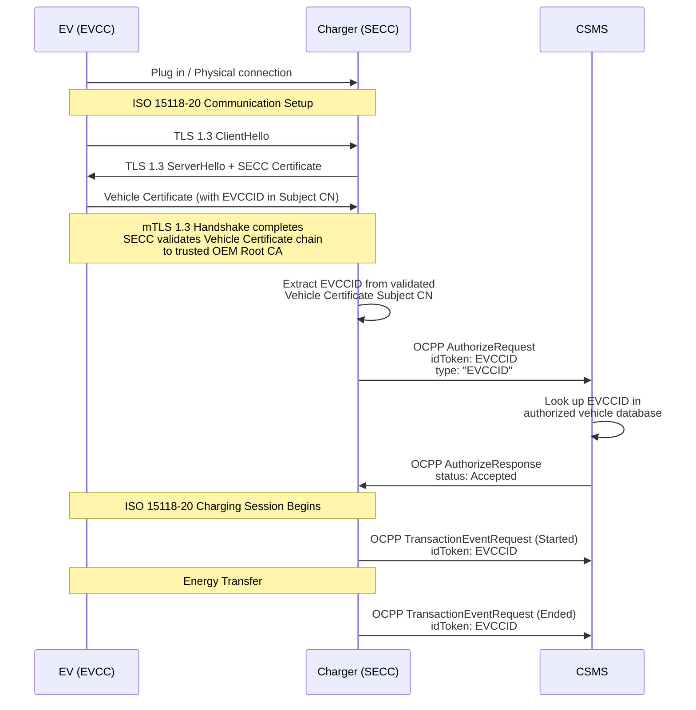
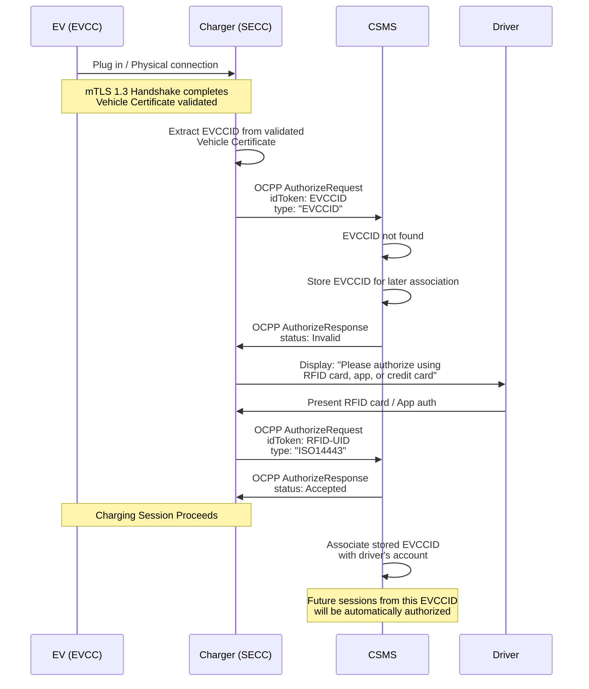

# SEID-Auth: Secure EVCCID Authorization for Electric Vehicle Charging

**Version:** 1.0 DRAFT
**Date:** March 2026
**Status:** Proposal for community review

---

## Table of Contents

1. [Introduction](#1-introduction)
2. [Motivation](#2-motivation)
3. [Core Concept](#3-core-concept)
4. [Protocol Specification](#4-protocol-specification)
5. [Enrollment Models](#5-enrollment-models)
6. [Certificate Renewal Handling](#6-certificate-renewal-handling)
7. [OCPP Integration](#7-ocpp-integration)
8. [Security Analysis](#8-security-analysis)
9. [Implementation Requirements](#9-implementation-requirements)
10. [Standards Body Engagement](#10-standards-body-engagement)
11. [Glossary](#11-glossary)
12. [References](#12-references)

---

## 1. Introduction

The EV charging industry has two approaches for automatic vehicle authorization. **[Autocharge](https://github.com/Autocharge-EV/Autocharge)** uses the EV's MAC address — simple but fundamentally insecure (spoofable, no cryptographic binding, broken by OEM MAC randomization). **Plug & Charge (PnC)** uses a full PKI ecosystem with contract certificates — cryptographically secure but requiring MO sub-CAs, contract certificate provisioning, a certificate pool, and bilateral roaming agreements on top of the base ISO 15118-20 PKI.

**SEID-Auth** introduces a third path. ISO 15118-20 mandates mutual TLS 1.3 for all communication sessions, including those using External Identification Means (EIM). The SECC already receives and validates the EV's Vehicle Certificate during every session. The EVCCID, embedded in the Vehicle Certificate's subject common name, is therefore always available as a cryptographically authenticated vehicle identifier — a byproduct of the mandatory security handshake.

SEID-Auth adds no PKI requirements beyond what ISO 15118-20 already mandates. The V2G Root CA trust anchors and OEM Root Certificate distribution are already necessary for the mTLS handshake itself. SEID-Auth simply uses the EVCCID — application-layer data already present in the validated certificate — for authorization via OCPP.

---

## 2. Motivation

### ISO 15118-20: mTLS for Every Session

In ISO 15118-2, TLS was optional for EIM sessions. ISO 15118-20 changes this: **mTLS 1.3 is mandatory for all communication sessions**. For every session, regardless of authorization method, the SECC:

1. Receives the EV's Vehicle Certificate during the TLS 1.3 handshake
2. Validates the certificate chain back to a trusted OEM Root CA
3. Verifies that the EV possesses the private key corresponding to the Vehicle Certificate

The EVCCID is always available as a cryptographically authenticated identifier. SEID-Auth simply leverages this.

### Why Now

The **Megawatt Charging System (MCS)** for heavy-duty vehicles mandates ISO 15118-20. As MCS deployment accelerates, trucks, buses, and heavy equipment will natively support the mTLS infrastructure SEID-Auth requires. Fleet operators managing these vehicles — at depots, logistics hubs, and corporate facilities — are the primary early beneficiaries. These private CPOs control their own EVSE and CSMS, making PnC's cross-operator complexity (roaming agreements, certificate pools, eMSP coordination) unnecessary overhead.

The EU's **AFIR regulation** (Commission Delegated Regulation (EU) 2025/656) mandates that from **January 1, 2027**, all newly installed or renovated public and private chargers must support ISO 15118-20. Every new charger in Europe will have the mTLS infrastructure SEID-Auth needs.

---

## 3. Core Concept

> **The EVCCID extracted from a cryptographically validated Vehicle Certificate during a successful mTLS 1.3 handshake is a secure, spoof-proof vehicle identifier that can be used for automatic authorization via OCPP.**

The security derives from two properties:

1. **The EVCCID is embedded in the Vehicle Certificate**, signed by the OEM's sub-CA. It cannot be altered without invalidating the certificate.
2. **The mTLS handshake proves possession** of the private key corresponding to the Vehicle Certificate. An attacker cannot present another vehicle's certificate without the associated private key.

### 3.1 EVCCID Structure

As defined in ISO 15118-20 (Annex C.5):

```
<EVCCID> = <WMI> <S> <ID Type> <S> <OEM's own unique ID> <S> <Check Digit>
```

Where:
- **WMI** (3 characters): World Manufacturer Identifier per ISO 3780
- **ID Type** (1 character): Fixed value "V" indicating a vehicle EVCCID
- **OEM's own unique ID** (15–250 characters): Manufacturer-specific unique vehicle identifier
- **Check Digit** (1 character): Integrity verification digit computed per ISO 15118-20 Annex C.6
- **S** (optional): Separator "-" for human readability, omitted in machine-to-machine communication

The minimum length is 20 characters (without separators) and the maximum is 255 characters. The EVCCID is case-insensitive.

Example: `DE8-V-AA0000453C4D58Y-2` (26 characters with separators, 22 without)

### 3.2 Security Invariant

> **The SECC SHALL only use the EVCCID for authorization if it was extracted from the Vehicle Certificate presented during a successfully completed and validated mTLS 1.3 handshake.**

The EVCCID string itself is not secret — it may be printed on the vehicle, visible in telematics systems, or known to the OEM. Security comes from the mTLS proof of possession, not from identifier secrecy.

The EVCCID appears in **two places** during an ISO 15118-20 session:

1. **In the Vehicle Certificate's Subject Common Name** — signed by the OEM's sub-CA and validated during the mTLS handshake. This is a **cryptographically authenticated** value.
2. **In the `SessionSetupReq` message** — a **self-asserted** value at the application layer. A compromised EVCC could send any arbitrary EVCCID in this message while holding a legitimate Vehicle Certificate with a different EVCCID.

This is the **most likely implementation pitfall**. The `SessionSetupReq` EVCCID is readily available in the application layer, tempting developers to use it directly. This would undermine the entire security model.

- The SECC **MUST** extract the EVCCID for OCPP authorization from the **Vehicle Certificate's Subject Common Name**.
- The SECC **SHOULD** cross-check this value with the EVCCID from `SessionSetupReq` and log a security event if they differ; it **MAY** reject the session.

---

## 4. Protocol Specification

### 4.1 Known Vehicle Flow



### 4.2 First-Time Vehicle Flow (Unknown EVCCID)



---

## 5. Enrollment Models

### 5.1 Model 1: First-See-and-Link (Universal)

Requires no pre-registration. On the first session, the CSMS does not recognize the EVCCID, stores it, and responds `Invalid`. The driver authenticates via a fallback method (RFID, app, credit card). After the session, the CPO/eMSP offers to link the EVCCID to the driver's account. Once linked, all subsequent sessions are authorized automatically.

This mirrors the existing Autocharge enrollment flow. The key difference is the cryptographic assurance provided by mTLS.

### 5.2 Model 2: Fleet Pre-Registration

For fleet operators — particularly private CPOs at depots, logistics hubs, and corporate facilities — pre-registration enables instant authorization from the first session. The fleet operator registers EVCCIDs in the CSMS (via management portal, API, or bulk import), obtained from OEM documentation, telematics, or initial onboarding at a trusted depot charger. All fleet vehicles are authorized immediately at any charger in the network — no per-vehicle contract certificate provisioning required.

---

## 6. Certificate Renewal Handling

### 6.1 Renewal Scenarios

**Same EVCCID after renewal (common case):** The OEM issues a renewed certificate with the same EVCCID. Whether the key pair is retained or regenerated is irrelevant — authorization is based on the EVCCID, not the public key. Authorization continues seamlessly.

**Changed EVCCID after renewal (rare):** The vehicle presents an unrecognized EVCCID. The First-See-and-Link flow is triggered, and the new EVCCID is associated with the existing account. The previous EVCCID should be disassociated. Operators MAY implement heuristics (e.g., same WMI prefix + recently deactivated EVCCID) to prompt proactive account migration. Fleet CPOs can handle this centrally via their management system.

### 6.2 Certificate Revocation

If a Vehicle Certificate is revoked, the SECC detects this during the mTLS handshake via OCSP stapling or CRL checking and rejects the TLS connection. The SEID-Auth flow is never reached. No additional revocation handling is required.

---

## 7. OCPP Integration

### 7.1 IdToken Type

OCPP 2.0.1 introduced the `IdToken` type enumeration and native certificate management support, making it the minimum version suitable for ISO 15118-20 integrations. SEID-Auth proposes a new IdToken type for OCPP 2.0.1/2.1:

| Type Value | Description |
|---|---|
| `EVCCID` | EVCCID extracted from a Vehicle Certificate validated during an ISO 15118-20 mTLS session |

### 7.2 IdToken Field Sizing

The EVCCID can be up to 255 characters; the current OCPP 2.0.1 `idToken` field maximum is 36 characters. Most realistic EVCCIDs fit within 36 characters (minimum structure is 20 characters). OCPP implementations supporting SEID-Auth SHOULD support lengths up to 255 characters to accommodate the full range defined by ISO 15118-20.

### 7.3 Interim Guidance

Until `EVCCID` is formally adopted by the Open Charge Alliance:

- **Preferred:** Use the `Central` IdToken type with the EVCCID value. The CSMS can distinguish SEID-Auth tokens by matching the EVCCID ABNF syntax (WMI + "V" + unique ID + check digit).
- **Alternative:** Use OCPP DataTransfer for vendor-specific encapsulation with full type information.

### 7.4 OCPP Message Examples

**AuthorizeRequest:**
```json
{
  "idToken": {
    "idToken": "DE8VAA0000453C4D58Y2",
    "type": "EVCCID"
  }
}
```

**AuthorizeResponse:**
```json
{
  "idTokenInfo": {
    "status": "Accepted"
  }
}
```

**TransactionEventRequest:**
```json
{
  "eventType": "Started",
  "timestamp": "2026-03-04T10:15:30Z",
  "triggerReason": "Authorized",
  "seqNo": 0,
  "transactionInfo": {
    "transactionId": "TX-20260304-001"
  },
  "idToken": {
    "idToken": "DE8VAA0000453C4D58Y2",
    "type": "EVCCID"
  }
}
```

---

## 8. Security Analysis

### 8.1 Comparison with Existing Methods

| Property                                      | MAC-Based Autocharge     | Plug & Charge (PnC)                   | SEID-Auth                          |
| --------------------------------------------- | ------------------------ | ------------------------------------- | ---------------------------------- |
| Identifier                                    | MAC address              | Contract Certificate (eMAID)          | EVCCID from Vehicle Certificate    |
| Cryptographic authentication                  | None                     | Full PKI (contract certs)             | mTLS 1.3 + Vehicle Certificate PKI |
| Spoofing resistance                           | Low (MAC easily spoofed) | High                                  | High                               |
| Man-in-the-middle protection                  | None                     | Yes (TLS)                             | Yes (mTLS 1.3)                     |
| Revocation support                            | Blacklists only          | OCSP/CRL via PKI                      | OCSP/CRL via OEM PKI               |
| Additional PKI beyond base 15118-20           | None                     | MO sub-CAs, contract certs, cert pool | **None**                           |
| Ecosystem complexity                          | Low                      | High                                  | Low–Medium                         |
| Requires contract certificates                | No                       | Yes                                   | No                                 |
| Requires certificate pool (beyond root certs) | No                       | Yes                                   | No                                 |
| Requires eMSP sub-CA                          | No                       | Yes                                   | No                                 |
| Works with ISO 15118-20 EIM                   | Yes (but insecure)       | No (PnC mode only)                    | Yes                                |
| Suited for private/fleet environments         | Partially (insecure)     | Overkill                              | **Ideal**                          |

### 8.2 Threat Analysis

**EVCCID Spoofing:** An attacker who knows a victim's EVCCID cannot complete the mTLS handshake without the victim vehicle's private key. The SECC rejects the TLS connection before authorization begins.

**Man-in-the-Middle:** Mitigated by TLS 1.3 encryption, integrity protection, and mutual authentication.

**Compromised Vehicle Private Key:** If extracted (e.g., physical attack on HSM), an attacker could impersonate the vehicle. Same threat model as PnC. Mitigation relies on OEM hardware security and certificate revocation upon detection.

**Rogue SECC:** A malicious charger could learn the EVCCID but cannot forge an mTLS session at a legitimate charger — the EV's private key is never transmitted. The EVCCID is not secret; security comes from mTLS proof of possession.

**Compromised SECC:** Could send fraudulent AuthorizeRequests. This threat exists for all OCPP-based authorization and is mitigated by OCPP security profiles (TLS between SECC and CSMS, CSMS authentication of the Charging Station).

### 8.3 Security Properties Summary

SEID-Auth inherits the authentication, integrity, and revocation properties of the underlying ISO 15118-20 mTLS infrastructure. The CSMS audit log of EVCCID and session data provides non-repudiation at the application layer.

---

## 9. Implementation Requirements

### 9.1 SECC Requirements

- MUST implement TLS 1.3 with mutual authentication per ISO 15118-20.
- MUST validate the full Vehicle Certificate chain to a trusted OEM Root CA before extracting the EVCCID.
- MUST extract the EVCCID for OCPP authorization from the Subject Common Name of a successfully validated Vehicle Certificate (see Section 3.2).
- MUST strip optional separators from the EVCCID before transmitting it in the OCPP AuthorizeRequest.
- MUST NOT extract or use the EVCCID if the mTLS handshake fails or the certificate chain is invalid.
- SHOULD cross-check this value with the EVCCID from `SessionSetupReq` and log a security event if they differ.
- SHOULD support OCPP 2.0.1 or later for the AuthorizeRequest with IdToken type field.

### 9.2 CSMS Requirements

- MUST support receiving and processing the `EVCCID` IdToken type (or interim equivalent).
- MUST maintain a mapping of EVCCIDs to customer/fleet accounts.
- MUST store unrecognized EVCCIDs for later account association (Model 1).
- SHOULD support pre-registration of EVCCIDs via fleet management interfaces (Model 2).
- SHOULD support `idToken` string lengths of up to 255 characters.
- SHOULD implement logic to detect and prompt EVCCID re-enrollment when a vehicle's EVCCID changes due to certificate renewal (Section 6.1).
- SHOULD validate the EVCCID format against the ABNF syntax defined in ISO 15118-20 Annex C.5, including check digit verification.

### 9.3 Interaction with Other Authorization Methods

SEID-Auth coexists with RFID (fallback for enrollment), app-based auth (alternative fallback and account management), Plug & Charge (SECC may prioritize PnC when contract certificates are present), and credit card terminals (independent, unaffected).

---

## 10. Standards Body Engagement

### 10.1 Open Charge Alliance (OCA)

- Addition of `EVCCID` to the OCPP IdToken `type` enumeration.
- Extension of `idToken` string maximum length to 255 characters.
- Target: OCPP 2.1 specification.

### 10.2 CharIN

- Present SEID-Auth as a complementary authorization mechanism leveraging mandatory mTLS.
- Include SEID-Auth scenarios in CharIN Testival interoperability events.

### 10.3 EVSE Manufacturers

- Engage SECC firmware teams during ISO 15118-20 implementation: SEID-Auth requires extracting one certificate field and adding one OCPP message field.

### 10.4 ISO TC22/SC31 (ISO 15118)

- No changes required. SEID-Auth operates within the existing framework using only existing protocol elements.

---

## 11. Glossary

| Term | Definition |
|---|---|
| **AFIR** | Alternative Fuels Infrastructure Regulation (EU 2023/1804) |
| **CCS** | Combined Charging System |
| **CPO** | Charge Point Operator |
| **CSMS** | Charging Station Management System |
| **EIM** | External Identification Means (e.g., RFID, app-based auth) |
| **eMSP** | e-Mobility Service Provider |
| **EVCC** | Electric Vehicle Communication Controller |
| **EVCCID** | Unique identifier of the EVCC, embedded in the Vehicle Certificate |
| **EVSE** | Electric Vehicle Supply Equipment |
| **MCS** | Megawatt Charging System (for heavy-duty vehicles) |
| **mTLS** | Mutual Transport Layer Security (both client and server authenticate) |
| **OCPP** | Open Charge Point Protocol |
| **OEM** | Original Equipment Manufacturer (vehicle manufacturer) |
| **PnC** | Plug & Charge (ISO 15118 contract-certificate-based authorization) |
| **PKI** | Public Key Infrastructure |
| **SECC** | Supply Equipment Communication Controller |
| **SEID-Auth** | Secure EVCCID Authorization (this proposal) |
| **TLS 1.3** | Transport Layer Security version 1.3 |
| **V2G** | Vehicle-to-Grid |
| **WMI** | World Manufacturer Identifier (per ISO 3780) |

---

## 12. References

1. **ISO 15118-20:2022** — Road vehicles — Vehicle to grid communication interface — Part 20: 2nd generation network layer and application layer requirements
2. **ISO 15118-2:2014** — Road vehicles — Vehicle to grid communication interface — Part 2: Network and application protocol requirements
3. **OCPP 2.0.1** — Open Charge Point Protocol 2.0.1, Open Charge Alliance
4. **OCPP 2.1 (draft)** — Open Charge Point Protocol 2.1, Open Charge Alliance (in development)
5. **Regulation (EU) 2023/1804** — Alternative Fuels Infrastructure Regulation (AFIR)
6. **Commission Delegated Regulation (EU) 2025/656** — Supplementing AFIR with technical specifications including ISO 15118-20 mandate from January 1, 2027
7. **ISO 3780** — Road vehicles — World manufacturer identifier (WMI) code
8. **RFC 8446** — The Transport Layer Security (TLS) Protocol Version 1.3
9. **Autocharge** — Autocharge-EV, https://github.com/Autocharge-EV/Autocharge
10. **CharIN e.V.** — Charging Interface Initiative, https://www.charin.global/

---

## Contributing

This document is published for community review. Contributions are welcome via GitHub Issues and Pull Requests.

---

## License

This work is licensed under [Creative Commons Attribution 4.0 International (CC BY 4.0)](https://creativecommons.org/licenses/by/4.0/).

---

*SEID-Auth is an independent community proposal and is not affiliated with or endorsed by the Open Charge Alliance, CharIN, ISO, or any vehicle manufacturer.*
